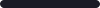

  

<h1 align="center">Hi there, I'm Pinaaa</h1>

   <b>Designing & building aesthetic web experiences</b> 

  <i>Exploring UI/UX & frontend development — turning ideas into real interfaces </i>

  
  
  
  

 

<h3 align="center">─── ❖ ── ✦ ── ❖ ───</h3>

 

###  { ABOUT ME }

<table border="0">
  <tr>
    <td valign="top">
      <pre>
┌──(refina@space)-[about]
└─$ whoami
Name      : Refina Kusuma
Role      : UI/UX • Frontend Dev
Focus     : Aesthetic UI Design
Stack     : HTML • CSS • JS
Approach  : Design → Code
Status    : Building projects
</pre>
    </td>
    <td valign="top">
      <pre>
┌──(refina@space)-[focus]
└─$ cat skills.txt
Design    : UI/UX • Wireframe
Frontend  : Responsive Web UI
Tools     : Figma • VS Code
Specialty : Clean interface
Now       : Learning • Building
Open for  : Collaboration
</pre>
    </td>
  </tr>
</table>

 

###  { TECH STACK }

<table border="0">
<tr>
<td valign="top">
<pre>
┌──(refina@space)-[design]
└─$ stack --design
• Figma
• Canva
• UI/UX Design
• Wireframing
• Prototyping
</pre>
</td>
<td valign="top">
<pre>
┌──(refina@space)-[frontend]
└─$ stack --frontend
• HTML5 / CSS3
• JavaScript
• React.js
• Next.js
• Tailwind CSS
</pre>
</td>
<td valign="top">
<pre>
┌──(refina@space)-[tools]
└─$ stack --tools
• Git / GitHub
• VS Code
• Webpack
• Vercel
• Postman
</pre>
</td>
</tr>
</table>

 

###  { GITHUB DASHBOARD }

  <table border="0" width="100%" cellspacing="8" cellpadding="0">
    <tr>
      <!-- ROW 1: Streak Stats -->
      <td width="50%" align="center" valign="top">
        

          
        

      </td>
      <!-- ROW 1: Activity Graph -->
      <td width="50%" align="center" valign="top">
        

          
        

      </td>
    </tr>
    <tr>
      <!-- ROW 2: Symmetrical Analytics Panel -->
      <td width="50%" align="left" valign="top">
        

          <h4 align="center" style="margin-top: 0; color: #bb9af7;"> { ANALYTICS DASHBOARD }</h4>
          <table border="0" width="100%" cellspacing="0" cellpadding="1">
            <tr>
              <td width="30%">TypeScript</td>
              <td width="60%"></td>
              <td width="10%" align="right">45%</td>
            </tr>
            <tr>
              <td>JavaScript</td>
              <td></td>
              <td align="right">25%</td>
            </tr>
            <tr>
              <td>PHP</td>
              <td></td>
              <td align="right">15%</td>
            </tr>
            <tr>
              <td>Python</td>
              <td></td>
              <td align="right">10%</td>
            </tr>
            <tr>
              <td>HTML/CSS</td>
              <td></td>
              <td align="right">5%</td>
            </tr>
          </table>
        

      </td>
      <!-- ROW 2: Commit Activity (Container Standardized) -->
      <td width="50%" align="center" valign="top">
        

          
        

      </td>
    </tr>
  </table>

 

 

<!-- 

  
  
  
  
  

 -->